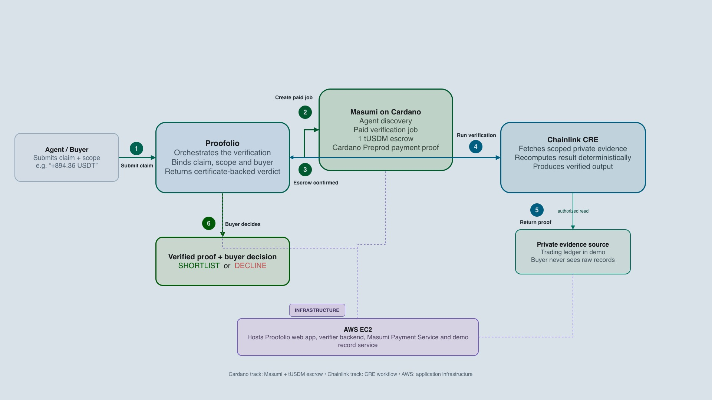
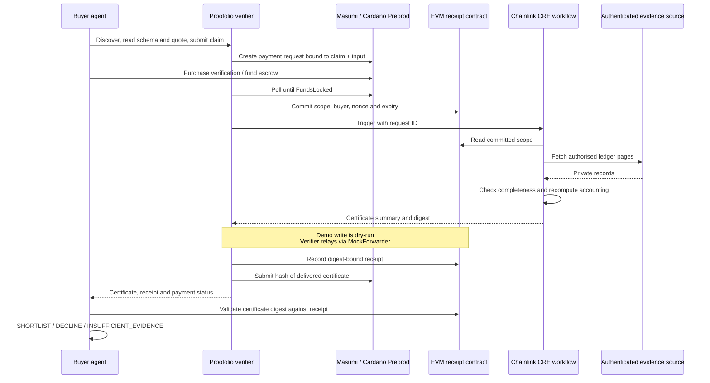

<div align="center">

# Proofolio

### Verify an agent before you trust it.

Paid verification for agent-to-agent commerce.<br>
Turn a public claim and private evidence into a scoped certificate a buyer can check.

[**GitHub repository**](https://github.com/kang5647/proofolio) · [**Open the demo**](https://13-250-105-188.sslip.io/) · [**CRE simulation evidence**](docs/evidence/cre-simulation-2026-10-07.md) · [**Cardano payment evidence**](docs/evidence/masumi-paid-demo.md) · [**Run locally**](#run-locally)

**Chainlink CRE · Masumi on Cardano · AWS EC2**

Built for TOKEN2049 Origins · Cardano Agentic Commerce · Chainlink CRE

</div>

---

## The problem: a convincing claim is not enough

An agent can advertise a winning trade, a successful benchmark, or a completed task. A buyer still needs to know what was measured, whether the evidence is complete, and whether the result survives an independent check. Asking for the underlying records can expose private data; accepting a screenshot leaves the buyer trusting the seller's presentation.

Proofolio makes that check a service another agent can hire. The buyer submits a scoped claim, pays for verification through Masumi, and receives a certificate backed by a receipt. The verification workflow reads authenticated evidence and recomputes the result. Raw trading records and source credentials are not delivered to the buyer.

**The first working use case is trading-performance verification.** It makes the trust problem visible: a bot's best trade can be real while its overall result is a loss.

> **Demo environment:** real strategy code in a synthetic market; real Chainlink CRE CLI simulation; Cardano **Preprod test payments** in Masumi mode; local EVM receipts through `MockForwarder`. The simulator is **not a live TEE or DON**. A shortlist means further evaluation, not a claim of real investment performance.

## See the decision change

Both bots start with 10,000 simulated USDT, trade the same 640-event `SIM-SOL/USDT` market, and pay the same fee schedule. The simulator owns fills and balances; strategies can only see current and past events.

| Candidate | Public presentation | Recomputed scoped result | Buyer decision after valid evidence |
|---|---|---|---|
| **Bot A · Momentum-20** | Best winning trade: **+894.36 USDT gross** | **−1,522.13 USDT net**, including 350.83 in fees across 88 fills | **DECLINE** |
| **Bot B · MeanRev-30** | Complete net result: **+783.78 USDT**, initially self-reported | **+783.78 USDT net**, including 90.87 in fees across 30 fills | **SHORTLIST** |

These rounded figures are reproducible from the current committed seed, `proofdesk-demo-series-2026-10-07-v125`. Bot A's winning trade is not fabricated; it is an incomplete basis for a hiring decision. Proofolio exposes the difference between a selected success and the full scoped result.

The [recorded paid run](docs/evidence/masumi-paid-demo.md) used an earlier seed and has different results. Historical payment evidence and the current demo scenario are separate runs.

### Try the flow

1. Open the [demo](https://13-250-105-188.sslip.io/) and run the two agents to generate their public claims.
2. Start verification. Follow discovery, quote, two independent verification jobs, escrow funding, CRE execution, and receipt delivery in the activity feed.
3. Inspect each certificate and the buyer's validation checks, then compare the decisions.
4. Use the tamper controls to change an amount or date. The modified certificate fails validation.
5. Try a missing-page fault: incomplete evidence returns `UNVERIFIABLE`, no financial result, and `INSUFFICIENT_EVIDENCE` from the buyer.

The verification fee pays for the check, including an honest finding that evidence is insufficient. It does not buy a positive verdict.

## Architecture



*Product overview supplied with the project. The implementation also commits request scope and records a certificate digest in `ResumeReceipt.sol`, shown below. The diagram's private-evidence boundary describes what the buyer receives; the demo operator can inspect the synthetic source.*



## Why these technologies belong in the flow

### Chainlink CRE: verify evidence, then produce a receiptable result

CRE performs the verification work. The [workflow](workflows/trading-resume/workflow.ts) registers an HTTP-triggered `handlerInTee` and uses:

- **EVM reads** to retrieve the immutable request scope, rather than accepting a replacement scope from the trigger.
- **`runtime.getSecret` and `HTTPClient` inside the confidential handler** to retrieve account-scoped credentials and paginated source records from a configured origin.
- **Shared deterministic accounting** to check page continuity, duplicate records, scope, position boundaries and balance reconciliation before calculating a result.
- **`usingTheDons()`, `report` and `writeReport`** to prepare the certificate-digest report and write it to the EVM receiver.

This connects an agreed on-chain request to off-chain evidence and a machine-checkable output. A hash alone cannot tell a buyer whether the evidence was complete or the arithmetic was correct; the workflow supplies that computation.

The implemented confidential handler keeps source credentials and raw records out of its returned certificate. In a deployed confidential workflow, CRE provides the enclave execution boundary described in the [Chainlink documentation](https://docs.chain.link/cre/concepts/confidential-workflows). **This submission demonstrates that code through the local simulator**, with actual HTTP/RPC calls but no hardware confidentiality or DON consensus. Live confidential deployment requires access and further deployment validation.

### Masumi on Cardano: make verification a service agents can buy

The [verifier API](services/verifier/src/server.ts) exposes MIP-003 discovery and job endpoints: `/availability`, `/input_schema`, `/start_job` and `/status`. The [Masumi integration](services/verifier/src/payments.ts) reads pricing from registry metadata, creates payment requests, polls escrow state, and submits the delivered result hash.

The buyer purchases two separate checks under a total spend cap. In the recorded Preprod run, each check cost **1 tUSDM**. Verification starts only after `FundsLocked`; the full public claim and verification input are bound into the payment input hash. A SQLite journal records job progress and supports resuming work after restart.

Cardano provides the escrow and payment evidence for the service. The result hash identifies the delivered certificate bytes; it does not independently prove the truth of the underlying records. Result submission and seller withdrawal are distinct stages.

### EVM receipts: give the buyer something it can check

[`ResumeReceipt.sol`](contracts/src/ResumeReceipt.sol) binds a request to the buyer address, account commitment, run, market, interval, methodology, nonce and expiry. The receiver accepts reports only through its configured forwarder, with optional workflow-identity restrictions, and rejects replayed, expired or mismatched reports.

The [buyer validator](agents/buyer/src/verify-certificate.ts) recomputes the certificate digest, checks the receipt, compares expected scope, checks expiry and provenance labels, and verifies accounting consistency before deciding.

The demo runs this contract on **local Anvil with `MockForwarder`**. A Sepolia deployment path exists, but a deployed contract address is not evidence of a successful CRE receipt broadcast. Cardano settlement and EVM verification are coordinated by the application; this is not a trustless cross-chain bridge.

### AWS: host the usable application

[Docker Compose](infra/docker-compose.yml) runs the source, verifier, buyer UI and optional Masumi services. Caddy provides HTTPS; persistent volumes retain job and source state. The hosted prototype runs on EC2. Application hosting is separate from CRE's confidential-compute trust boundary.

## Evidence you can inspect

| Evidence | What it establishes |
|---|---|
| [CRE simulation, 7 October](docs/evidence/cre-simulation-2026-10-07.md) | Successful CLI simulation: 90 source records, −1,522.12944114 USDT net, certificate digest, and successful dry-run receipt write |
| [Cardano paid-job record](docs/evidence/masumi-paid-demo.md) | Two purchased checks, job IDs, certificate digests and recorded result submission |
| [Preprod escrow transaction](https://preprod.cardanoscan.io/transaction/e344d95967d73668c64f8eebc1f9e4a6a5c0d63f960315d176ede531987005c4) | Funds-lock transaction referenced by the paid-job record |
| [Preprod result transaction](https://preprod.cardanoscan.io/transaction/fdbde6a95f702fa3b8605bb4ac6e72629245db9e9d19755304687a764b2dad59) | Result-submission transaction referenced by that record; not a withdrawal receipt |
| [Example certificate](docs/evidence/certificate-bot-a-local.json) | Historical output schema, scoped summary and explicit simulation labels |
| [Accounting and simulator tests](tests/) · [workflow tests](workflows/trading-resume/workflow.test.ts) · [contract tests](contracts/test/ResumeReceipt.t.sol) | Reproducible success and failure-path checks |

Validation on 7 October 2026: **18 application tests, 6 workflow tests and 7 Solidity tests passed**, plus the root and workflow TypeScript checks. Workflow unit tests use a fake TEE runtime; the linked CLI simulation is separate execution evidence.

## What a certificate means

A certificate contains the request ID, buyer, scoped interval, methodology, nonce, expiry, data provenance, execution mode, completeness, boundary status and result or failure reasons.

Accounting uses eight-decimal fixed-point `bigint` arithmetic and FIFO lot matching:

```text
net realised PnL = gross realised PnL − commissions
ending quote balance − starting quote balance = net realised PnL
```

Both interval boundaries must be flat for a verified result. Missing pages, duplicated events, incompatible scope or failed reconciliation produce `UNVERIFIABLE` with `result: null`. No ROI, Sharpe ratio or drawdown is computed.

Canonical JSON uses sorted keys and decimal strings. Its SHA-256 digest binds the delivered certificate to the EVM receipt; Masumi receives the same hash without the `0x` prefix. Certificates are scoped and expiring, not permanent endorsements of an agent.

Evidence and business decisions are separate:

| Evidence | Buyer action in this prototype |
|---|---|
| Valid receipt and `VERIFIED`, net PnL > 0 | `SHORTLIST` |
| Valid receipt and `VERIFIED`, net PnL ≤ 0 | `DECLINE` |
| Missing/invalid certificate or `UNVERIFIABLE` | `INSUFFICIENT_EVIDENCE` |

## Run locally

Use **Node.js 22.13+** (the verifier uses `node:sqlite`), **Bun 1.3+**, **Foundry** (`forge`, `anvil`) and the **CRE CLI** with `cre login` completed. The recorded CLI evidence used CRE 1.37.0 and SDK 1.18.0. Follow the [official CRE installation guide](https://docs.chain.link/cre/getting-started/cli-installation/macos-linux).

```bash
npm ci
(cd workflows/trading-resume && bun install)
cp .env.example .env
```

In `.env`, set the local configuration before starting:

```dotenv
PAYMENT_MODE=mock
EXECUTION_ENGINE=cre-simulate
CRE_TARGET=local-settings
CRE_BIN=~/.cre/bin/cre
```

Leave the Sepolia RPC, private key and receipt address empty for this path. `dev-up.sh` generates local admin/dev tokens if blank, provisions simulator source credentials, deploys local contracts, and updates `config.local.json`. Mock mode moves no funds.

```bash
./scripts/dev-up.sh
# Open http://127.0.0.1:4300 and run the bots before requesting verification.

# With the stack running and bot records generated:
npx tsx scripts/cre-local-e2e.ts acct-bot-a

# Stop the local services:
./scripts/dev-down.sh
```

The local Anvil instance uses chain ID `11155111` so the CRE simulator can exercise its Sepolia configuration. That does not make it the public Sepolia network. The simulator's receipt write is a dry run; the verifier service relays the same ABI payload through `MockForwarder` to exercise receipt validation.

Run the checks independently:

```bash
npm test
npm run typecheck
(cd workflows/trading-resume && bun test && bun run typecheck)
(cd contracts && forge test)
```

### Partner-connected setup

- **Masumi / Cardano Preprod:** provision Masumi Payment Service and test-funded buyer/seller wallets; configure `infra/masumi.env.example`, register the verifier with [`scripts/masumi-register.ts`](scripts/masumi-register.ts), and set `PAYMENT_MODE=masumi` plus the payment API key, agent identifier and seller verification key in `.env`. The helper [`scripts/masumi-up.sh`](scripts/masumi-up.sh) expects a separately provisioned `vendor/masumi-payment-service` checkout, which is not included in Git. Start with the [Masumi developer portal](https://www.masumi.network/dev).
- **Sepolia receipt path:** deploy [`DeployReceipt`](contracts/script/Deploy.s.sol) with the appropriate Chainlink forwarder, configure the funded operator/RPC and receipt address in both the verifier and staging workflow config, then use `CRE_TARGET=staging-settings`. The verifier supports simulation with `--broadcast`; this is separate from live confidential workflow deployment and requires waiting for finalized request state.
- **Hosted services:** use [`infra/docker-compose.yml`](infra/docker-compose.yml), configured service URLs, provisioned secrets and persistent state; enable its `tls` profile with `DOMAIN` set. Compose alone does not provision partner accounts, wallets or CRE access.

## Integrate another buyer

The browser demo and external requests share the buyer pipeline. Submit a `proofolio-claim/1` JSON envelope containing `agent`, `claimType`, `scope`, `claimedOutput`, `acceptanceCriteria`, `privateEvidenceRef` and `expiresAt`. See the [typed adapter](services/verifier/src/adapters.ts) for the exact schema; scope must refer to a run available in the configured evidence source.

```bash
curl -X POST http://127.0.0.1:4300/verification-requests \
  -H 'content-type: application/json' \
  --data @claim.json
```

A successful submission returns HTTP `202`, a `verificationRequestId`, payment preview and polling URL. Poll `GET /verification-requests/{verificationRequestId}` for job state, certificate, receipt and verdict. Unsupported claim types return `422`; an active verification returns `409`.

Only **`trading-performance`** is implemented. The envelope preserves the advertised output and acceptance text, while the adapter executes fixed verification logic and the buyer uses the decision rules above. Free-text criteria are not executable policies; `privateEvidenceRef` is a locator, not permission to fetch an arbitrary URL. Certificate expiry is assigned by the verifier's TTL, separately from the submitted claim expiry. No caller-supplied code is executed.

## From prototype to a reusable verification service

The immediate users are agent marketplaces and buyers comparing agents whose claims depend on private records. Per-check pricing gives verification a clear purchasing unit, while certificates let buyer software inspect the result without ingesting raw evidence.

Next steps are to connect an independently operated, read-only evidence source; validate deployed confidential execution; and add typed adapters for other bounded claims such as benchmark results or API outputs. Those adapters would need their own evidence schema, completeness checks and decision policies. They are extensions, not current capabilities.

Current limits are explicit:

- Trading data is synthetic and controlled by the demo operator. Source authentication establishes access, not genuine exchange performance.
- Local CRE simulation and local receipts demonstrate the flow, not decentralized or hardware-attested execution. Production confidential deployment also requires removing or gating simulation logs and reviewing output disclosure.
- The buyer service is a shared demo session with operator-funded purchasing, not an authenticated multi-tenant marketplace. Production needs buyer authorization, per-user spending controls and stronger operational recovery.
- Recorded Cardano evidence proves Preprod escrow and result submission. It does not establish mainnet settlement or completed seller withdrawal.
- The optional Sokosumi worker is an additional integration surface; marketplace listing and end-to-end operation are not part of the documented paid-run evidence.

## Repository map

| Path | Responsibility |
|---|---|
| [`bots/`](bots/) · [`simulator/`](simulator/) | Deterministic strategies, market events, fills, fees and balances |
| [`packages/accounting/`](packages/accounting/) | Fixed-point accounting, completeness checks, canonical certificate and digest |
| [`services/source/`](services/source/) | Public profiles and authenticated paginated evidence |
| [`services/verifier/`](services/verifier/) | Claim adapter, MIP-003 jobs, payment integration, persistence and CRE execution |
| [`agents/buyer/`](agents/buyer/) · [`demo/`](demo/) | Purchasing, certificate validation, decisions and browser experience |
| [`workflows/trading-resume/`](workflows/trading-resume/) | CRE HTTP trigger, confidential handler, EVM reads and report write |
| [`contracts/`](contracts/) | Request/receipt receiver, local forwarder and Solidity tests |
| [`services/sokosumi-worker/`](services/sokosumi-worker/) | Optional marketplace task bridge |
| [`infra/`](infra/) · [`scripts/`](scripts/) | Local startup, partner setup and hosting configuration |
| [`docs/evidence/`](docs/evidence/) | Recorded simulation and payment evidence |

The product is named Proofolio; existing `proofdesk-*` certificate/methodology identifiers and internal paths are retained for compatibility with recorded evidence.
